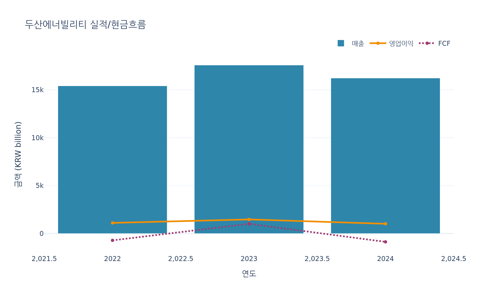
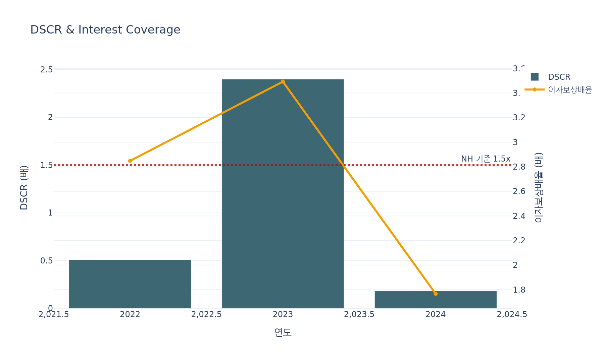
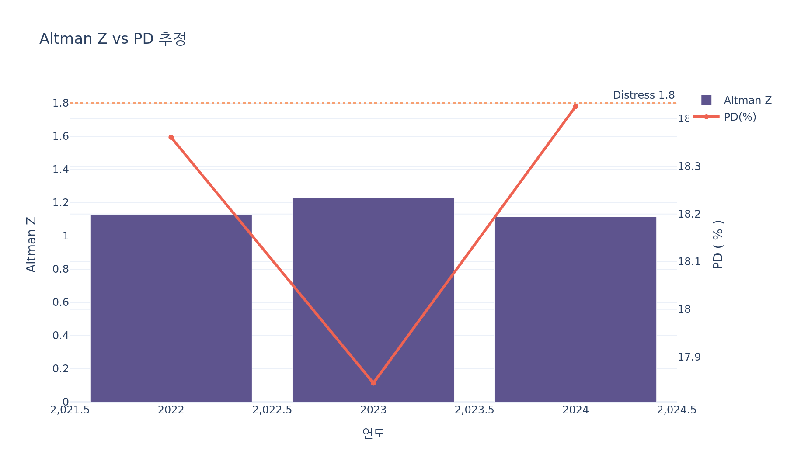
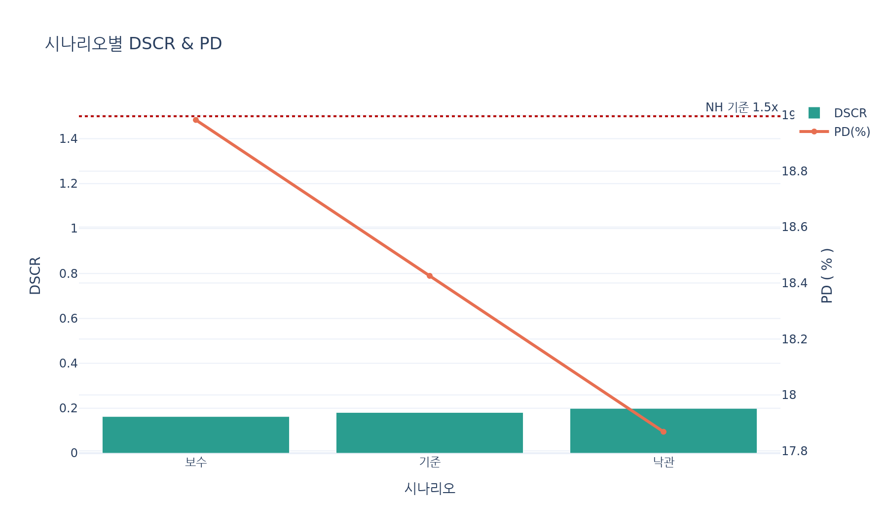

# 두산에너빌리티 여신분석 리포트

- 커버리지: 2022~2024 (최근 3개 연도)
- 데이터 출처: FnGuide SVD_Finance
- 재무제표 기준: 연결, IFRS, 단위: KRW billion
- 목적: 여신심사-김성규 관점의 기업여신 심사 참고

## 0. 핵심 영어 약어 & 활용 맥락

| 약어 | 풀네임·정의 | 현업 활용 |
| --- | --- | --- |
| **DSCR** | Debt Service Coverage Ratio = OCF / (이자+원금) | 은행이 현금흐름으로 빚을 갚을 수 있는지 판단할 때 |
| **PD** | Probability of Default (부도확률) | 여신등급, 한도, 가격결정 등 리스크 판단 |
| **LGD** | Loss Given Default | 기대손실(ECL)과 충당금 계산 |
| **EBITDA** | Earnings Before Interest, Taxes, Depreciation, Amortization | 레버리지 비교, 기업가치 평가 |
| **ROIC** | Return on Invested Capital | 투자 효율, EVA 분석 |
| **FCF** | Free Cash Flow = OCF – CAPEX | 배당·부채상환 여력 검토 |
| **OCF** | Operating Cash Flow | 상환 재원 검증 |

## 1. 실행 요약
- 두산에너빌리티 posted 16233.1 KRW bn revenue in 2024 with an operating margin of 6.3%.
- EBITDA coverage at 1.8x, ROIC 5.9%, DSCR 0.2x and estimated PD 18.4% ground repayment views.

## 2. 실적 및 현금흐름

| 연도 | 매출 | 영업이익 | EBITDA | 순이익 | FCF |
| --- | --- | --- | --- | --- | --- |
| 2022 | 15,421.1 | 1,106.1 | 3,488.1 | -453.2 | -715.8 |
| 2023 | 17,589.9 | 1,467.3 | 3,014.7 | 517.5 | 1,014.4 |
| 2024 | 16,233.1 | 1,017.6 | 2,361.8 | 394.7 | -872.2 |

## 3. 레버리지·커버리지 지표

| 연도 | 부채비율(x) | 유동비율(x) | 이자보상배율(x) | DSCR(x) | ROIC | 부채/EBITDA | NetDebt/EBITDA | OCF마진 | OCF/총부채 | FCF/총부채 | OCF/CAPEX | 알트만Z | PD(모형추정) | LGD Proxy | CAPEX/매출 | 영업이익률 | EBITDA마진 | FCF마진 |
| --- | --- | --- | --- | --- | --- | --- | --- | --- | --- | --- | --- | --- | --- | --- | --- | --- | --- | --- |
| 2022 | 1.29 | 1.00 | 2.85 | 0.51 | 7.4% | 3.72 | 3.32 | 4.1% | 0.05 | -0.06 | 0.47 | 1.13 | 18.4% | 64.9% | 8.7% | 7.2% | 22.6% | -4.6% |
| 2023 | 1.27 | 1.00 | 3.49 | 2.40 | 9.8% | 4.58 | 3.71 | 11.8% | 0.15 | 0.07 | 1.96 | 1.23 | 17.8% | 60.9% | 6.0% | 8.3% | 17.1% | 5.8% |
| 2024 | 1.26 | 1.12 | 1.77 | 0.18 | 5.9% | 6.20 | 4.98 | 1.5% | 0.02 | -0.06 | 0.22 | 1.11 | 18.4% | 61.8% | 6.9% | 6.3% | 14.5% | -5.4% |

## 4. 시나리오 스트레스 체크

| 시나리오 | 매출 | 영업이익 | EBITDA | FCF | 이자보상배율(x) | DSCR(x) | FCF마진 | PD(모형추정) |
| --- | --- | --- | --- | --- | --- | --- | --- | --- |
| 보수 | 14,609.8 | 915.8 | 2,125.6 | -785.0 | 1.59 | 0.16 | -5.4% | 19.0% |
| 기준 | 16,233.1 | 1,017.6 | 2,361.8 | -872.2 | 1.77 | 0.18 | -5.4% | 18.4% |
| 낙관 | 17,856.4 | 1,119.4 | 2,598.0 | -959.4 | 1.94 | 0.20 | -5.4% | 17.9% |

NH농협 내부 기준(DSCR ≥ 1.5x, 모형 PD < 5%) 대비 여신여력 변화를 시뮬레이션.

## 5. 여신관점 스토리라인

**강점**
- Top-line compounded at 2.6% across the review window.

**리스크**
- Free cash flow margin is negative, implying reliance on external funding.
- Altman Z-score at 1.1 signals heightened default sensitivity.
- DSCR has slipped below 1.2x threshold, pressuring debt service headroom.
- Model-implied PD 18.4% suggests elevated risk tier.

## 6. 제언
- Maintain exposure with covenants on leverage (<2.0x) and interest coverage (>2.5x), and tie limits to project milestone cash-in milestones.

## 7. 시각화
Plotly 차트를 통해 주요 지표 변화를 직관적으로 확인:

_작성: Changwon Credit Lab, 뷰: 여신심사-김성규_